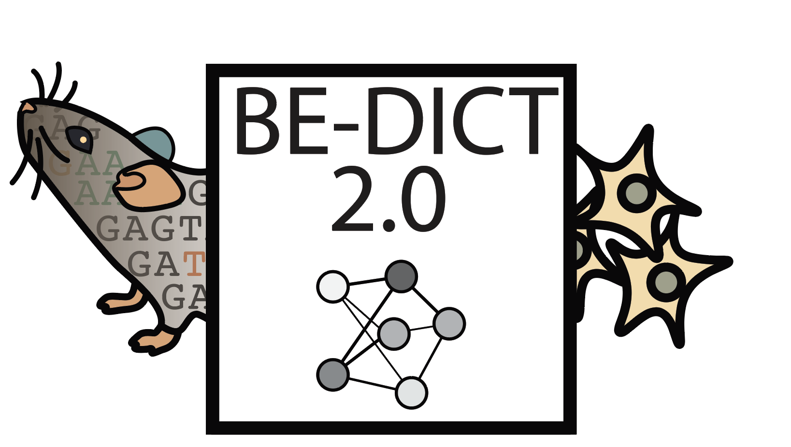
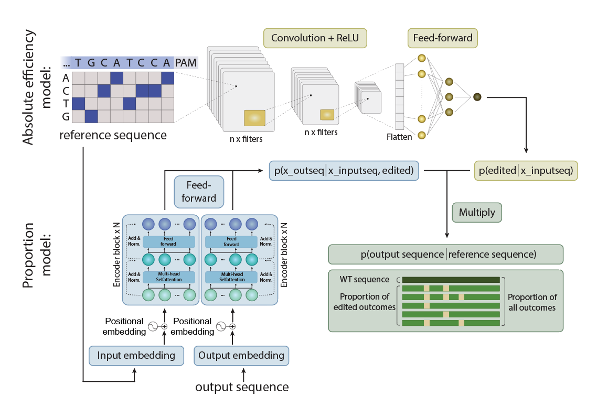

# BEDICT-V2:Predicting base editing outcomes with an attention-based deep learning algorithm

<p align="center">
  
</p>

---

## Overview

BEDICT-V2 is a deep learning model designed to predict base editing outcomes using an attention-based algorithm. This repository provides the source code and instructions for using the model.
<p align="center">
  
</p>
---

## Table of Contents

- [Environment Setup](#environment-setup)
  - [Step 1: Create a Virtual Environment](#step-1-create-a-virtual-environment)
- [Usage](#usage)
  - [Try the Model on Your Own Sequence](#try-the-model-on-your-own-sequence)
  - [Retrain the Model](#retrain-the-model)
- [Contributing](#contributing)
- [License](#license)

---
## The folder structure:
```
packages/button
├── absolute_efficiency_model
│   ├── models
│   ├── output
│   └── src
├── dataset
├── main_py_files
│   ├── train.py
│   ├── ....
│   └──inference.py
├── dataset
├── notebooks
├── proportion_model
│   ├── output
│   └── src
├── utils
├── web_application
│   ├── templates
│   ├── static
│   └── app.y
├── README.md
└── requirment.txt
```

## Environment Setup

### Set up the environment

Create a virtual environment and install the required dependencies using [Conda](https://docs.conda.io/en/latest/):

```bash
# Create a virtual environment
conda create --name bedict_v2

# Activate the virtual environment
conda activate bedict_v2

# Install dependencies
pip install -r requirements.txt

```

In the above example, the first three backticks start the code block, and the closing three backticks indicate the end of the code block. The text after the closing backticks is back to normal text.
## Usage

### Try the Model on Your Own Sequence

To use the pre-trained model on your own DNA sequence, follow these steps:

1. **Install Dependencies:**
   Make sure you have the required dependencies installed. If you haven't done so, refer to the [Environment Setup](#environme:wq!nt-setup) section.

2. **Get the trained model**
   Download the pretrained model and place it in the right folder

3.  **Do inference**

Go to the foler main_py_files and call inference.py file, before that, you can select the method (in vivo or in vitro), editor in the config file and run inference.py
```bash
python inference.py
```

### Train the model on your own dataset

To deploy our model on your dataset, where you will train our model on your screening data, follow these steps:

1. **Prepare the data:**

There is an example data you will find in the dataset store in exel file, where it includes columsn with target protospacer (20 bases), pam information (four bases), and outcome sequence (20 bases)

2.  **Pre-process the data:**

Go to the foler main_py_files and run generate_two_stage_model_data, input the exel file name

```bash
python inference.py
```

2.  **Train the model:**

Go to the foler main_py_files and call inference.py file, before that, you can select the method (in vivo or in vitro), editor in the config file and run inference.py


2.  **Infer the model:**

Go to the foler main_py_files and call inference.py file, before that, you can select the method (in vivo or in vitro), editor in the config file and run inference.py